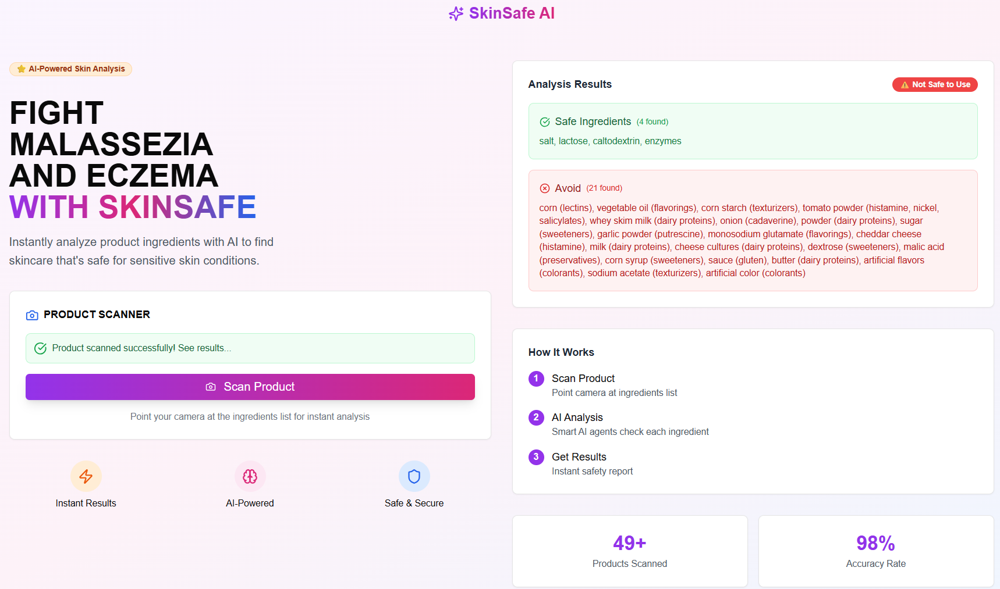

# SkinSafe AI 🧴🤖



Instantly analyze product ingredient lists with AI to determine if they’re safe for **eczema** and **malassezia**-prone skin.

---

## 🚀 What It Does

* **Scans product labels** from images or barcodes.
* Uses **EasyOCR** for text extraction and **CLIP** for image type classification.
* Identifies food/cosmetic ingredients and cross-references them with a trigger database.
* Returns a **Safe / Avoid** breakdown with trigger categories.

---

## 🛠 How to Run

### 1️⃣ Install dependencies

```bash
pip install -r requirements.txt
```

### 2️⃣ Start the backend

```bash
uvicorn main:app --reload --host 0.0.0.0 --port 8000
```

---

## 📂 Project Structure (Key Files)

* `main.py` → FastAPI backend entry point.
* `classify_item.py` → Classifies image type.
* `ingredient_list.py` → Extracts ingredients from text.
* `identify_food.py` → Identifies food items & matches against triggers.
* `recommend.py` → LLM-powered safe/avoid classification.
